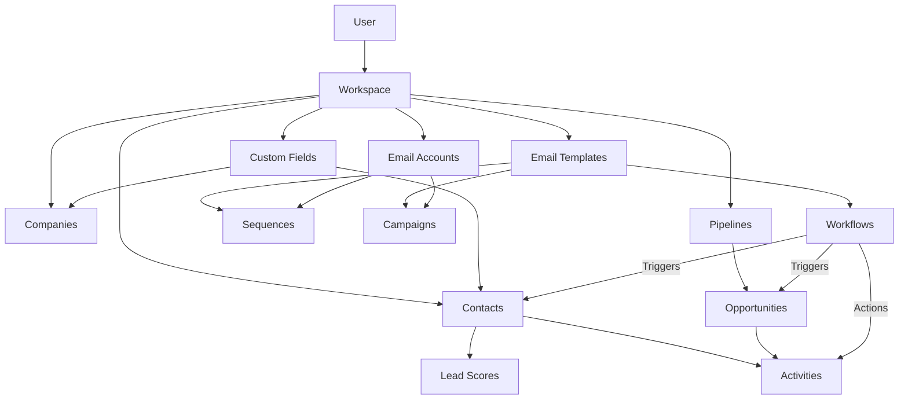

# CRM Features Guide

This document explains all the core entities and features in the CRM system. Each section covers what the entity is, its columns/properties, and how to use it.

---

## Table of Contents

1. [Contact](#1-contact)
2. [Company](#2-company)
3. [Pipeline](#3-pipeline)
4. [Opportunity (Deal)](#4-opportunity-deal)
5. [Activity](#5-activity)
6. [Email Template](#6-email-template)
7. [Sequence](#7-sequence)
8. [Campaign](#8-campaign)
9. [Email Account](#9-email-account)
10. [Workflow](#10-workflow)
11. [Lead Score](#11-lead-score)
12. [Custom Field](#12-custom-field)
13. [User](#13-user)
14. [Workspace (Project)](#14-workspace-project)

---

## Quick Reference Table

| Entity | Purpose |
|--------|---------|
| **Contact** | Individual people you're selling to |
| **Company** | Organizations contacts belong to |
| **Pipeline** | Visual sales stages (Kanban boards) |
| **Opportunity** | Deals/revenue opportunities |
| **Activity** | Timeline of all interactions |
| **Email Template** | Reusable email content |
| **Sequence** | Personal multi-step outreach |
| **Campaign** | Bulk email at scale |
| **Email Account** | Connected sending accounts |
| **Workflow** | Automated if-this-then-that rules |
| **Lead Score** | Points-based lead ranking |
| **Custom Field** | Extra data columns |
| **User** | Team members/login accounts |
| **Workspace** | Organization/project container |

---

## 1. Contact

### What is it?
A **Contact** represents an individual person in your CRM. This is who you're communicating with and selling to.

### Key Columns

| Column | Type | Description |
|--------|------|-------------|
| `firstName` | String | First name (required) |
| `lastName` | String | Last name (required) |
| `email` | String | Email address |
| `phone` | String | Phone number |
| `company` | String | Company name (text) |
| `companyId` | Reference | Link to Company record |
| `jobTitle` | String | Job title |
| `status` | Enum | lead, prospect, customer, inactive |
| `source` | String | Where they came from (Website, Referral) |
| `tags` | Array | Labels for categorization |
| `assignedTo` | Reference | Team member ownership |
| `linkedin` | String | LinkedIn URL |
| `address` | Object | Street, city, state, country, zipCode |
| `customFields` | Map | Your custom data |
| `lastContactedAt` | Date | Last interaction date |
| `notes` | String | Free-form notes |

### Special Features

**Apollo Enrichment:**
```typescript
apolloEnrichment: {
  enrichedAt: Date,
  apolloId: String,
  confidence: Number,      // 0-1
  fieldsEnriched: String[] // ['email', 'phone', 'linkedin']
}
```

**Email Verification:**
```typescript
emailVerification: {
  status: 'valid' | 'invalid' | 'risky' | 'unknown',
  verifiedAt: Date,
  provider: 'apollo' | 'zerobounce'
}
```

**AI Insights:**
```typescript
aiInsights: {
  sentiment: 'positive' | 'neutral' | 'negative',
  engagementScore: Number,     // 0-100
  recommendedActions: String[]
}
```

**Employment Tracking (Data Stewardship):**
```typescript
employmentStatus: 'active' | 'left_company' | 'unknown'
previousCompany: String
previousJobTitle: String
linkedContactId: ObjectId  // New contact after job change
```

### Status Values

| Status | Description |
|--------|-------------|
| `lead` | New, unqualified |
| `prospect` | Qualified, in pipeline |
| `customer` | Paying customer |
| `inactive` | Churned or unresponsive |

---

## 2. Company

### What is it?
A **Company** represents an organization. Multiple Contacts can belong to one Company.

### Key Columns

| Column | Type | Description |
|--------|------|-------------|
| `name` | String | Company name (required) |
| `industry` | String | Industry type |
| `website` | String | Website URL |
| `phone` | String | Phone number |
| `companySize` | Enum | 1-10, 11-50, 51-200, 201-500, 501-1000, 1000+ |
| `annualRevenue` | Number | Annual revenue |
| `employeeCount` | Number | Number of employees |
| `linkedinUrl` | String | LinkedIn company page |
| `address` | Object | Street, city, state, country, zipCode |
| `status` | Enum | lead, prospect, customer, churned |
| `tags` | Array | Labels for categorization |
| `assignedTo` | Reference | Team member ownership |
| `customFields` | Map | Your custom data |

### Company Size Options
```
'1-10' | '11-50' | '51-200' | '201-500' | '501-1000' | '1000+'
```

### Relationship with Contacts
- One Company → Many Contacts
- Contact.`companyId` links to Company.`_id`

---

## 3. Pipeline

### What is it?
A **Pipeline** is a visual board with stages (like a Kanban). Used to track deals/opportunities through your sales process.

### Key Columns

| Column | Type | Description |
|--------|------|-------------|
| `name` | String | Pipeline name (required) |
| `description` | String | Pipeline description |
| `stages[]` | Array | Ordered list of stages |
| `isDefault` | Boolean | Default pipeline for workspace |
| `isActive` | Boolean | Whether pipeline is active |

### Stage Structure

```typescript
{
  _id: ObjectId,
  name: 'Qualified',    // Stage name
  order: 1,             // Position (0, 1, 2...)
  color: '#22c55e'      // Hex color for UI
}
```

### Example Pipeline

```
Lead → Qualified → Proposal → Negotiation → Closed Won / Closed Lost
```

### Rules
- 1-20 stages per pipeline
- Only one default pipeline per workspace
- Stages must have unique order numbers

---

## 4. Opportunity (Deal)

### What is it?
An **Opportunity** (also called a Deal) represents a potential sale. It moves through Pipeline stages until won or lost.

### Key Columns

| Column | Type | Description |
|--------|------|-------------|
| `title` | String | Deal name (required) |
| `value` | Number | Deal value/amount (required) |
| `currency` | String | Currency code (USD, EUR) |
| `pipelineId` | Reference | Which pipeline it's in |
| `stageId` | Reference | Current stage |
| `contactId` | Reference | Associated contact |
| `companyId` | Reference | Associated company |
| `probability` | Number | Win probability (0-100%) |
| `expectedCloseDate` | Date | When you expect to close |
| `actualCloseDate` | Date | When it actually closed |
| `status` | Enum | open, won, lost, abandoned |
| `lostReason` | String | Why the deal was lost |
| `assignedTo` | Reference | Deal owner |
| `priority` | Enum | low, medium, high |
| `dealTemperature` | Enum | hot, warm, cold |
| `nextAction` | String | Next step to take |
| `nextActionDueDate` | Date | When next action is due |

### Status Values

| Status | Description |
|--------|-------------|
| `open` | Active, in progress |
| `won` | Deal closed successfully |
| `lost` | Deal lost to competitor/no decision |
| `abandoned` | Deal abandoned |

### Stage History
Every stage change is tracked:
```typescript
stageHistory: [{
  stageId: ObjectId,
  stageName: 'Qualified',
  enteredAt: Date,
  exitedAt: Date,
  duration: Number  // milliseconds in stage
}]
```

### AI Insights
```typescript
aiInsights: {
  dealScore: Number,           // 0-100
  closeProbability: Number,    // AI-calculated
  recommendedActions: String[],
  riskFactors: String[],
  confidenceLevel: Number
}
```

---

## 5. Activity

### What is it?
An **Activity** is a logged interaction. It creates a timeline of all communications and actions for contacts, companies, and deals.

### Key Columns

| Column | Type | Description |
|--------|------|-------------|
| `type` | Enum | Type of activity |
| `title` | String | Activity title (required) |
| `description` | String | Detailed notes |
| `entityType` | Enum | contact, deal, company, opportunity |
| `entityId` | Reference | Which record it's for |
| `direction` | Enum | inbound, outbound |
| `duration` | Number | Call duration in seconds |
| `dueDate` | Date | For tasks |
| `completed` | Boolean | Task completion status |
| `automated` | Boolean | True if created by workflow |

### Activity Types

| Type | Description |
|------|-------------|
| `email` | Email sent/received |
| `call` | Phone call |
| `meeting` | Meeting/appointment |
| `note` | General note |
| `stage_change` | Deal moved to new stage |
| `file_upload` | Document uploaded |
| `task` | To-do item |
| `ai_suggestion` | AI recommendation |
| `workflow_action` | Automated workflow action |

### Workflow Context (for automated activities)
```typescript
workflowId: ObjectId,
workflowEnrollmentId: ObjectId,
workflowStepId: String,
automated: true
```

---

## 6. Email Template

### What is it?
An **Email Template** is a reusable email with placeholders. Used in Sequences, Campaigns, and Workflows.

### Key Columns

| Column | Type | Description |
|--------|------|-------------|
| `name` | String | Template name (required) |
| `subject` | String | Email subject line (required) |
| `body` | String | HTML email content (required) |
| `category` | Enum | welcome, follow-up, nurture, promotion, announcement, custom |
| `description` | String | Template description |
| `variables` | Array | Detected merge variables |
| `isDefault` | Boolean | System template vs user template |
| `usageCount` | Number | How often used |
| `thumbnailColor` | String | Color for UI preview |

### Using Variables
Variables are automatically detected using `{{variableName}}` syntax:

```html
Hi {{firstName}},

I noticed your company {{company}} is growing.
Would you have time for a {{duration}}-minute call?

Best,
{{senderName}}
```

### Categories

| Category | Use Case |
|----------|----------|
| `welcome` | New lead/customer onboarding |
| `follow-up` | Post-meeting/call follow-up |
| `nurture` | Long-term relationship building |
| `promotion` | Special offers/announcements |
| `announcement` | Company news/updates |
| `custom` | User-defined purpose |

---

## 7. Sequence

### What is it?
A **Sequence** is a personal, multi-step outreach automation. It sends emails (and creates tasks) over time, and automatically stops when someone replies.

### Key Columns

| Column | Type | Description |
|--------|------|-------------|
| `name` | String | Sequence name (required) |
| `status` | Enum | draft, active, paused, archived |
| `steps[]` | Array | Ordered steps to execute |
| `enrollments[]` | Array | Contacts in the sequence |
| `sendFromAccountId` | Reference | Gmail/email account to send from |
| `unenrollOnReply` | Boolean | Stop when contact replies (default: true) |
| `sendOnWeekends` | Boolean | Send on Sat/Sun |
| `sendWindowStart` | String | Start time (e.g., "09:00") |
| `sendWindowEnd` | String | End time (e.g., "18:00") |
| `timezone` | String | Timezone (e.g., "America/New_York") |

### Step Types

| Type | Description |
|------|-------------|
| `email` | Send an email |
| `task` | Create a manual task for the rep |
| `linkedin` | LinkedIn outreach action |

### Step Structure
```typescript
{
  id: 'step_1',
  order: 1,
  type: 'email',
  subject: 'Quick question',
  body: 'Hi {{firstName}}...',
  delay: { value: 2, unit: 'days' },
  templateId: ObjectId  // Optional - use template
}
```

### Enrollment Tracking
```typescript
{
  contactId: ObjectId,
  status: 'active' | 'completed' | 'unenrolled' | 'replied' | 'bounced',
  currentStepIndex: 2,
  emailsSent: 3,
  emailsOpened: 2,
  emailsClicked: 1,
  nextEmailAt: Date
}
```

### When to Use
- ✅ Sales outreach to specific leads
- ✅ Personal 1-on-1 follow-ups
- ✅ When you want automatic stop on reply

---

## 8. Campaign

### What is it?
A **Campaign** is a bulk email system for large-scale outreach. It supports multiple sending accounts, daily limits, and conditional steps.

### Key Columns

| Column | Type | Description |
|--------|------|-------------|
| `name` | String | Campaign name (required) |
| `status` | Enum | draft, active, paused, completed |
| `fromAccounts[]` | Array | Email accounts to rotate |
| `dailyLimit` | Number | Max emails per day (default: 50) |
| `sendingSchedule` | Object | Timezone, time window, weekends |
| `steps[]` | Array | Email sequence steps |
| `stats` | Object | Performance metrics |

### Sending Schedule
```typescript
sendingSchedule: {
  timezone: 'America/New_York',
  startTime: '09:00',
  endTime: '17:00',
  sendOnWeekends: false
}
```

### Campaign Step
```typescript
{
  id: 'step_1',
  order: 1,
  type: 'email',
  delayDays: 3,
  delayHours: 0,
  subject: 'Following up...',
  body: 'Hi {{firstName}}...',
  useAIPersonalization: true,
  sendIf: {
    previousEmailOpened: true  // Only send if they opened step 1
  }
}
```

### Stats Tracked
```typescript
stats: {
  sent: 1000,
  delivered: 980,
  opened: 450,
  clicked: 120,
  replied: 85,
  bounced: 20,
  unsubscribed: 5,
  positiveReplies: 60,
  negativeReplies: 25
}
```

### Sequence vs Campaign

| Feature | Sequence | Campaign |
|---------|----------|----------|
| Scale | Small (1-100) | Large (100s-1000s) |
| Stop on Reply | ✅ Yes | ❌ No |
| Account Rotation | ❌ No | ✅ Yes |
| Conditional Steps | ❌ No | ✅ Yes |
| Best For | Sales | Marketing |

---

## 9. Email Account

### What is it?
An **Email Account** is a connected Gmail or SMTP account used to send emails. Supports warmup and health monitoring.

### Key Columns

| Column | Type | Description |
|--------|------|-------------|
| `email` | String | Email address (required) |
| `provider` | Enum | gmail, smtp |
| `status` | Enum | active, warming_up, paused, disconnected |
| `dailySendLimit` | Number | Max emails per day |
| `sentToday` | Number | Emails sent today |
| `warmupEnabled` | Boolean | Warmup mode on/off |
| `warmupCurrentDaily` | Number | Current warmup volume |
| `warmupTargetDaily` | Number | Target warmup volume |
| `bounceRate` | Number | Bounce rate % |
| `spamRate` | Number | Spam complaint rate % |
| `openRate` | Number | Open rate % |
| `replyRate` | Number | Reply rate % |
| `healthStatus` | Enum | healthy, warning, critical |
| `healthIssues` | Array | List of detected issues |

### Status Values

| Status | Description |
|--------|-------------|
| `active` | Ready to send at full capacity |
| `warming_up` | Building reputation slowly |
| `paused` | Temporarily disabled |
| `disconnected` | OAuth/connection lost |

### Warmup System
New accounts start with low volume and gradually increase:
```typescript
warmupEnabled: true,
warmupStartDate: Date,
warmupCurrentDaily: 5,   // Currently sending 5/day
warmupTargetDaily: 50,   // Goal is 50/day
warmupSlowRamp: true     // Increase slowly
```

---

## 10. Workflow

### What is it?
A **Workflow** is an automation rule: "When X happens, do Y." It triggers based on events and executes actions automatically.

### Key Columns

| Column | Type | Description |
|--------|------|-------------|
| `name` | String | Workflow name (required) |
| `status` | Enum | draft, active, paused, archived |
| `triggerEntityType` | Enum | contact, deal, company |
| `steps[]` | Array | Workflow steps |
| `enrollmentCriteria` | Object | Conditions to enroll |
| `goalCriteria` | Object | Conditions to complete |
| `allowReenrollment` | Boolean | Can contacts re-enter? |
| `stats` | Object | Performance metrics |

### Trigger Types

| Trigger | Fires When |
|---------|-----------|
| `contact_created` | New contact added |
| `contact_updated` | Contact field changed |
| `contact_job_changed` | Contact changed jobs |
| `deal_created` | New deal added |
| `deal_stage_changed` | Deal moved to new stage |
| `email_opened` | Email opened |
| `email_clicked` | Email link clicked |
| `form_submitted` | Form submitted |
| `webhook_received` | External webhook received |
| `manual` | Manually triggered |

### Action Types

| Action | Does |
|--------|------|
| `send_email` | Send an email |
| `update_field` | Update a field value |
| `create_task` | Create a task |
| `assign_owner` | Assign to team member |
| `add_tag` | Add a tag |
| `remove_tag` | Remove a tag |
| `send_notification` | Send internal notification |
| `enroll_workflow` | Enroll in another workflow |
| `update_lead_score` | Add/remove points |
| `send_webhook` | Call external API |
| `apollo_enrich` | Enrich with Apollo.io |

### Step Types

| Type | Description |
|------|-------------|
| `trigger` | Starting event |
| `action` | Do something |
| `delay` | Wait before continuing |
| `condition` | If/else branching |

### Example Workflow
```
Trigger: Contact Created
  ↓
Delay: 1 day
  ↓
Action: Send Welcome Email
  ↓
Condition: Email Opened?
  ↓ Yes                    ↓ No
Send Follow-up Email    Add Tag "Unengaged"
```

---

## 11. Lead Score

### What is it?
**Lead Score** is a points-based system to rank contacts by engagement. Higher scores = more qualified leads.

### Key Columns

| Column | Type | Description |
|--------|------|-------------|
| `contactId` | Reference | Contact being scored |
| `currentScore` | Number | Current point total |
| `previousScore` | Number | Score before last change |
| `grade` | Enum | A, B, C, D, F |
| `scoreHistory[]` | Array | Log of score changes |
| `lastActivityAt` | Date | Last scoring activity |
| `decayedAt` | Date | Last decay applied |

### Grade Thresholds

| Grade | Score Range |
|-------|-------------|
| A | 80+ |
| B | 60-79 |
| C | 40-59 |
| D | 20-39 |
| F | 0-19 |

### Score Events
```typescript
scoreHistory: [{
  eventType: 'email_opened',
  points: 5,
  reason: 'Opened welcome email',
  timestamp: Date,
  metadata: { emailId: '...' }
}]
```

### Common Scoring Rules

| Event | Points |
|-------|--------|
| Email opened | +5 |
| Email clicked | +10 |
| Form submitted | +20 |
| Meeting booked | +30 |
| Website visited | +3 |
| 30 days inactive | -10% decay |

### Time Decay
Scores automatically decrease over time for inactive leads to keep the leaderboard fresh.

---

## 12. Custom Field

### What is it?
**Custom Fields** let you add extra data columns to Contacts or Companies that aren't built-in.

### Key Columns

| Column | Type | Description |
|--------|------|-------------|
| `entityType` | Enum | contact, company |
| `fieldKey` | String | Unique key (must start with `custom_`) |
| `fieldLabel` | String | Display name in UI |
| `fieldType` | Enum | text, number, select |
| `selectOptions[]` | Array | Dropdown options (for select type) |
| `isRequired` | Boolean | Required to fill |
| `defaultValue` | Any | Default value |
| `order` | Number | Display order |
| `isActive` | Boolean | Whether field is active |

### Field Types

| Type | Description | Example |
|------|-------------|---------|
| `text` | Free-form text | Notes, IDs |
| `number` | Numeric value | Budget, score |
| `select` | Dropdown | Lead source, industry |

### Naming Rules
- Keys MUST start with `custom_`
- Lowercase only
- Only letters, numbers, underscores

```
✅ custom_lead_source
✅ custom_annual_budget
❌ leadSource (missing prefix)
❌ custom-lead-source (no hyphens)
```

### Example Custom Fields

**Text Field:**
```typescript
{
  entityType: 'contact',
  fieldKey: 'custom_linkedin_url',
  fieldLabel: 'LinkedIn URL',
  fieldType: 'text'
}
```

**Number Field:**
```typescript
{
  entityType: 'company',
  fieldKey: 'custom_employee_count',
  fieldLabel: 'Employee Count',
  fieldType: 'number',
  defaultValue: 0
}
```

**Select Field:**
```typescript
{
  entityType: 'contact',
  fieldKey: 'custom_lead_source',
  fieldLabel: 'Lead Source',
  fieldType: 'select',
  selectOptions: ['Website', 'Referral', 'Cold Outreach', 'Event']
}
```

---

## 13. User

### What is it?
A **User** is a team member with login access to the CRM.

### Key Columns

| Column | Type | Description |
|--------|------|-------------|
| `email` | String | Email address (required, unique) |
| `password` | String | Hashed password (for email auth) |
| `name` | String | Display name (required) |
| `isVerified` | Boolean | Email verified |
| `authProvider` | Enum | email, google |
| `googleId` | String | Google OAuth ID |
| `profilePicture` | String | Avatar URL |

### Auth Providers

| Provider | How |
|----------|-----|
| `email` | Email + password |
| `google` | Google OAuth sign-in |

---

## 14. Workspace (Project)

### What is it?
A **Workspace** (also called Project) is the top-level container. All data is scoped to a workspace.

### Key Columns

| Column | Type | Description |
|--------|------|-------------|
| `userId` | Reference | Owner of workspace |
| `name` | String | Workspace name (required) |
| `timezone` | String | Default timezone (e.g., "America/New_York") |

### Data Hierarchy
```
User
  └── Workspace
        ├── Contacts
        ├── Companies
        ├── Pipelines
        │     └── Opportunities
        ├── Activities
        ├── Email Templates
        ├── Sequences
        ├── Campaigns
        ├── Workflows
        ├── Custom Fields
        └── Email Accounts
```

---

## How They All Work Together



---

## Summary

| Entity | One-liner |
|--------|-----------|
| **Contact** | People you're selling to |
| **Company** | Organizations contacts belong to |
| **Pipeline** | Visual sales stages |
| **Opportunity** | Deals with value and close dates |
| **Activity** | Timeline of all interactions |
| **Email Template** | Reusable email content |
| **Sequence** | Personal multi-step follow-up |
| **Campaign** | Bulk email at scale |
| **Email Account** | Connected Gmail/SMTP |
| **Workflow** | Automated if-then rules |
| **Lead Score** | Points-based lead ranking |
| **Custom Field** | Extra data columns |
| **User** | Team member login |
| **Workspace** | Organization container |

> [!TIP]
> **Typical Setup Order:**
> 1. Create Workspace
> 2. Connect Email Accounts
> 3. Set up Pipelines
> 4. Add Custom Fields
> 5. Create Email Templates
> 6. Build Workflows & Sequences
> 7. Import Contacts & Companies
> 8. Create Opportunities
