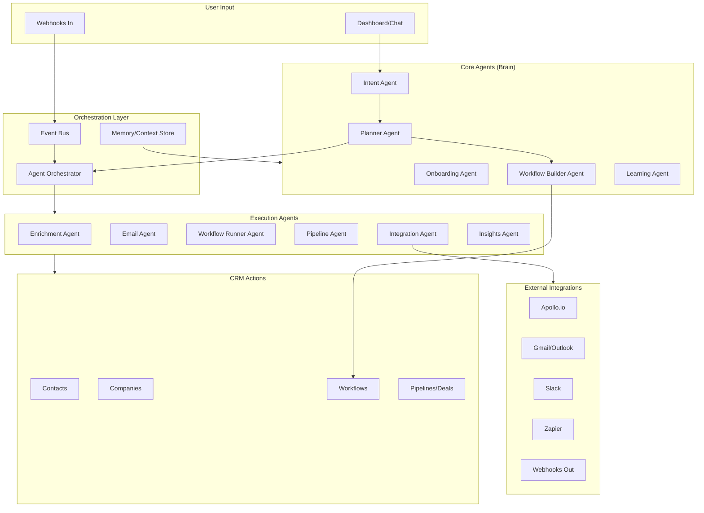

# Multi-Agent Sales & Marketing Automation System

Build an autonomous multi-agent system that can **plan, build, and execute** sales and marketing workflows. Agents collaborate to understand client goals, create strategies, and automatically build workflows/automations.

---

## Existing AI Implementation (Will Be Integrated)

> [!TIP]
> The current AI implementation is a **solid foundation** that will be repurposed, not removed.

| Component | Current Use | New Role |
|-----------|-------------|----------|
| `gemini.ts` | Chat responses, action parsing | Base for **Intent Agent** |
| `agent.ts` route | Chat API endpoint | **Agent Router** (routes to all agents) |
| `useAgentStore.ts` | Chat state management | Multi-agent state orchestration |
| Agent UI components | Chat sidebar | **Unified Agent Interface** |

**Key Changes:**
- Refactor `gemini.ts` → `IntentAgent.ts` (focused NLU)
- Add agent routing in `agent.ts` (Intent → Planner → Workflow Builder)
- Extend `useAgentStore` for multi-agent state
- Keep UI components, add agent selection/status

---

## Architecture Overview



---

## Core Agents (The Brain)

### 1. Onboarding Agent
**Purpose**: Guides new users through setup via conversational interview

| Input | Output |
|-------|--------|
| User answers to questions | Structured business context for Planner |

**Interview Flow**:
```
1. "What's your business type?" → SaaS, E-commerce, Services, etc.
2. "What's your sales process?" → Inbound, Outbound, Both
3. "Team size?" → Solo, Small (2-5), Medium (6-20), Large (20+)
4. "Key goals?" → Lead gen, Nurturing, Closing, Retention
5. "Current tools?" → Email, Calendar, Phone, etc.
```

**Output to Planner**:
```yaml
BusinessContext:
  type: SaaS
  salesProcess: inbound
  teamSize: small
  goals: [lead_nurturing, closing]
  integrations: [gmail, apollo]
SetupPlan:
  - Create pipeline with custom stages
  - Set up lead nurturing workflow
  - Configure email sync
  - Enable Apollo enrichment
```

---

### 2. Intent Agent
**Purpose**: Understands user requests and routes to appropriate agents

| Input | Output |
|-------|--------|
| Natural language request | Structured intent + context |

**Example Flow**:
```
User: "I want to follow up with all leads who visited our pricing page"
Intent Agent → { intent: "create_automation", entity: "leads", 
                 trigger: "page_visit", page: "pricing", 
                 action: "follow_up" }
```

---

### 2. Planner Agent
**Purpose**: Decomposes high-level goals into actionable steps

| Input | Output |
|-------|--------|
| Structured intent from Intent Agent | Execution plan with ordered steps |

**Example Plan**:
```yaml
Goal: "Automate lead nurturing for pricing page visitors"
Steps:
  1. Create segment: contacts who visited /pricing
  2. Build workflow with:
     - Trigger: page_visit = /pricing
     - Wait: 1 day
     - Action: send_email (template: pricing_follow_up)
     - Condition: if no_reply after 3 days
     - Action: create_task (sales rep follow-up)
  3. Activate workflow
  4. Create dashboard widget for tracking
```

---

### 3. Workflow Builder Agent
**Purpose**: Translates plans into actual CRM workflows

| Input | Output |
|-------|--------|
| Execution plan from Planner | Created workflows (pending approval) |

**Capabilities**:
- Generate workflow steps from plan
- Configure triggers, conditions, delays
- Set up email templates
- **Requires user confirmation before activation**
- Validate workflow logic

**Confirmation Flow**:
```
Workflow Builder creates draft → Shows preview to user → User approves/edits → Activated
```

---

### 4. Learning Agent
**Purpose**: Improves automations over time based on performance data

| Trigger | Action |
|---------|--------|
| Weekly schedule | Analyze workflow performance |
| Poor metrics detected | Suggest optimizations |
| User requests optimization | Recommend changes |

**Metrics Tracked**:
- Email open/click rates
- Workflow completion rates
- Contact response times
- Deal conversion rates

**Example Optimization**:
```
Learning Agent: "Your pricing follow-up email has 12% open rate. 
                Similar campaigns perform better at 2pm. 
                → Suggest: Change send time from 9am to 2pm?"
```

---

## Execution Agents

| Agent | Trigger | Action |
|-------|---------|--------|
| **Enrichment** | New contact without data | Enrich via Apollo |
| **Email Agent** | Send/receive/sync | Full email management |
| **Workflow Runner** | Workflow triggers | Execute workflow steps |
| **Pipeline Agent** | Deal events | Manage deals & stages |
| **Integration Agent** | External events/actions | Connect third-party services |
| **Insights** | Daily/on-demand | Analyze patterns |

### Email Agent Capabilities
- **Send**: Compose and send emails (individual/bulk)
- **Sync**: Import emails from Gmail/Outlook
- **Templates**: Create and manage email templates
- **Campaigns**: Run email sequences
- **Tracking**: Open/click tracking, bounce handling
- **Reply detection**: Auto-log replies as activities

### Pipeline Agent Capabilities
- Create new pipelines with stages
- Auto-assign deals to pipelines based on criteria
- Move deals through stages based on triggers
- Notify sales reps of stage changes
- Track pipeline velocity metrics

---

## External Integrations

### Integration Agent
**Purpose**: Central hub for all third-party connections

| Capability | Description |
|------------|-------------|
| **Inbound Webhooks** | Receive events from external services |
| **Outbound Webhooks** | Send CRM events to external services |
| **OAuth Management** | Handle authentication for integrations |
| **Data Sync** | Bi-directional data synchronization |

### Webhook System
```
Inbound:  POST /api/webhooks/{workspaceId}/{integrationId}
Outbound: Configurable triggers → POST to external URLs
```

**Security:**
- HMAC signature verification
- Rate limiting per workspace
- IP allowlisting (optional)

### Supported Integrations

| Integration | Type | Actions |
|-------------|------|---------|
| **Apollo.io** | Enrichment | Contact/company enrichment, search |
| **Gmail/Outlook** | Email | Send, sync, track |
| **Slack** | Notification | Send alerts, deal updates |
| **Zapier** | Automation | Trigger/action connector |
| **Calendly** | Scheduling | Meeting booked events |
| **Stripe** | Payments | Invoice/payment events |
| **HubSpot** | CRM Sync | Bi-directional contact sync |

### Integration Connector Interface
```typescript
interface IIntegrationConnector {
  id: string;
  name: string;
  
  // Authentication
  getAuthUrl(): string;
  handleCallback(code: string): Promise<Credentials>;
  
  // Actions
  executeAction(action: string, params: any): Promise<any>;
  
  // Events
  handleWebhook(payload: any): Promise<void>;
  subscribeToEvents(events: string[]): Promise<void>;
}

---

## Implementation Phases

### Phase 1: Foundation (Week 1-2)
- Agent Orchestrator + Event Bus
- Base Agent class with lifecycle
- Memory/Context store for agent state
- Agent configuration models

### Phase 2: Core Agents (Week 3-4)
- Intent Agent (with Gemini for NLU)
- Planner Agent (strategy decomposition)
- Workflow Builder Agent (uses existing Workflow model)

### Phase 3: Execution Agents (Week 5)
- Wrap existing services as agents
- Enrichment Agent (Apollo integration)
- Email Sync Agent (Gmail integration)

### Phase 4: Dashboard & Autonomy (Week 6-7)
- Agent management UI
- Natural language automation builder
- Real-time execution monitoring
- Autonomous suggestion system

---

## Key Design Decisions

> [!IMPORTANT]
> **Workspace-scoped**: Each workspace has its own agent configurations and context

> [!NOTE]
> **Gemini-powered**: Intent and Planner agents use Gemini for understanding and planning

> [!TIP]
> **Incremental autonomy**: Start with user confirmation, gradually increase autonomy based on confidence

---

## New Files Structure

```
backend/src/
├── services/
│   └── agents/
│       ├── AgentOrchestrator.ts    # Central coordinator
│       ├── EventBus.ts             # Event pub/sub
│       ├── MemoryStore.ts          # Agent context/memory
│       ├── BaseAgent.ts            # Abstract base class
│       ├── IntentAgent.ts          # NLU + intent extraction
│       ├── PlannerAgent.ts         # Strategy decomposition
│       ├── WorkflowBuilderAgent.ts # Auto-create workflows
│       ├── EnrichmentAgent.ts      # Apollo wrapper
│       └── EmailSyncAgent.ts       # Gmail wrapper
├── models/
│   └── AgentConfig.ts              # Agent configuration model
└── routes/
    └── agents.ts                   # Agent management API
```

---

## Test Cases

### Core Agents

#### Intent Agent Tests
| Test Case | Input | Expected Output | Edge Case |
|-----------|-------|-----------------|-----------|
| Simple intent | "Create a contact" | `{ intent: "create_contact" }` | - |
| Ambiguous input | "Add John" | Clarification: "Add as contact or company?" | Ambiguous entity |
| Multi-intent | "Create contact and send email" | `[create_contact, send_email]` | Multiple actions |
| Empty input | "" | Error: "Please provide a request" | Empty string |
| Gibberish | "asdfghjkl" | Error: "I didn't understand that" | Invalid input |
| Context-dependent | "Follow up with them" | Use selected items context | Pronoun resolution |

#### Planner Agent Tests
| Test Case | Input | Expected Output | Edge Case |
|-----------|-------|-----------------|-----------|
| Simple goal | Intent: create workflow | 3-5 step plan | - |
| Complex goal | "Automate entire sales process" | Multi-phase plan | Large scope |
| Missing context | "Set up for my business" | Request: "What industry?" | Insufficient info |
| Conflicting goals | "Increase speed and reduce cost" | Prioritized plan | Trade-offs |
| Impossible goal | "Send email to everyone ever" | Scoped alternative | Unrealistic |

#### Workflow Builder Agent Tests
| Test Case | Input | Expected Output | Edge Case |
|-----------|-------|-----------------|-----------|
| Valid plan | 5-step workflow plan | Draft workflow created | - |
| Invalid trigger | Plan with unknown trigger | Error + suggestions | Bad trigger type |
| Circular workflow | A→B→A | Error: "Circular dependency" | Infinite loop |
| Duplicate name | Same name as existing | Add suffix or error | Name conflict |
| Empty stages | Workflow with no actions | Warning: "No actions" | Empty workflow |

#### Learning Agent Tests
| Test Case | Input | Expected Output | Edge Case |
|-----------|-------|-----------------|-----------|
| Good performance | 40% open rate | "Performing well" | Above average |
| Poor performance | 5% open rate | Optimization suggestions | Below threshold |
| No data | New workflow, 0 runs | "Need more data" | Insufficient data |
| Declining trend | 30%→20%→10% | Alert + action plan | Regression |

#### Onboarding Agent Tests
| Test Case | Input | Expected Output | Edge Case |
|-----------|-------|-----------------|-----------|
| Complete flow | All questions answered | Full setup plan | Happy path |
| Skip questions | "Skip this" | Use defaults | Partial input |
| Change answer | "Actually, I meant..." | Update context | Mid-flow correction |
| Invalid answer | "My team size is purple" | Re-ask question | Invalid response |

---

### Execution Agents

#### Email Agent Tests
| Test Case | Input | Expected Output | Edge Case |
|-----------|-------|-----------------|-----------|
| Send email | Valid recipient + content | Email sent | - |
| Invalid email | "not-an-email" | Error: "Invalid email" | Bad format |
| Bulk send | 1000 recipients | Queued, rate-limited | Large batch |
| Template missing | Reference deleted template | Error + fallback | Missing dependency |
| Bounce handling | Bounced email | Mark contact, log activity | Delivery failure |

#### Pipeline Agent Tests
| Test Case | Input | Expected Output | Edge Case |
|-----------|-------|-----------------|-----------|
| Create pipeline | Valid stages | Pipeline created | - |
| Move deal | Deal ID + stage ID | Deal moved | - |
| Invalid stage | Move to non-existent stage | Error: "Stage not found" | Bad reference |
| Delete with deals | Delete pipeline with active deals | Warning/block | Data loss risk |
| Concurrent moves | 2 users move same deal | Last write wins + log | Race condition |

#### Enrichment Agent Tests
| Test Case | Input | Expected Output | Edge Case |
|-----------|-------|-----------------|-----------|
| Valid contact | Email + name | Enriched data | - |
| No match | Unknown email | "No data found" | Apollo miss |
| Rate limited | Many requests | Queued, retry later | API limits |
| Partial data | Some fields missing | Partial update | Incomplete enrichment |

#### Integration Agent Tests
| Test Case | Input | Expected Output | Edge Case |
|-----------|-------|-----------------|-----------|
| Webhook receive | Valid payload + signature | Event processed | - |
| Invalid signature | Wrong HMAC | 401 Unauthorized | Security |
| OAuth connect | Auth code | Credentials stored | - |
| OAuth expired | Expired token | Auto-refresh | Token lifecycle |
| Outbound webhook | Trigger event | POST to external URL | - |
| Integration down | Slack unavailable | Queue + retry | Service outage |
| Rate limit | Too many calls | Backoff + notify user | API limits |

---

### Integration & E2E Tests

| Test Case | Description | Agents Involved |
|-----------|-------------|-----------------|
| **Full onboarding** | New user → interview → setup complete | Onboarding → Planner → all |
| **Chat to workflow** | "Nurture pricing visitors" → active workflow | Intent → Planner → Builder |
| **Auto-enrichment** | New contact → enriched in 5s | Event Bus → Enrichment |
| **Pipeline automation** | Deal stage change → email sent | Pipeline → Email |
| **Learning loop** | Poor metrics → suggestion → user approves | Learning → Planner → Builder |

---

### Error & Recovery Tests

| Scenario | Expected Behavior |
|----------|-------------------|
| API timeout | Retry 3x with backoff, then error |
| Gemini unavailable | Fallback to cached responses |
| DB write failure | Rollback, notify user |
| Agent crash | Orchestrator restarts, preserves state |
| Circular agent calls | Max depth limit, break loop |
