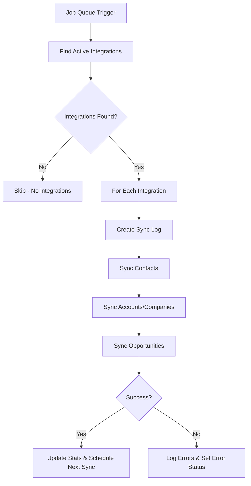

# Salesforce Sync Job - Complete Documentation

## 📋 Overview

The **Salesforce Sync Job** is an automated background process that runs **every 15 minutes** to keep your MrMorris CRM data synchronized with Salesforce. It enables **bidirectional sync** between your CRM and Salesforce, ensuring both systems always have the latest data.

## 🎯 Purpose

The sync job automatically:
- Pushes new/updated **Contacts**, **Companies**, and **Opportunities** from MrMorris → Salesforce
- Pulls modified **Contacts**, **Accounts**, and **Opportunities** from Salesforce → MrMorris
- Tracks sync status and errors
- Maintains data consistency across both platforms

## 🏗️ Architecture

### Components

1. **salesforceSyncJob.ts** - Scheduled job that triggers sync
2. **SalesforceService.ts** - Business logic for sync operations
3. **SalesforceIntegration.ts** - Model storing OAuth credentials and configuration
4. **FieldMapping.ts** - Maps CRM fields ↔ Salesforce fields
5. **SyncLog.ts** - Tracks sync history and errors

### Technology Stack

- **BullMQ** - Job queue system (backed by Redis)
- **jsforce** - Salesforce API client library
- **MongoDB** - Stores integration config and sync data
- **Redis** - Queue management and job scheduling

## ⚙️ How It Works

### 1. Job Scheduling

```typescript
// Runs every 15 minutes using cron pattern
pattern: '*/15 * * * *'
```

The job is added to a Redis-backed queue when the server starts:
- **Schedule**: Every 15 minutes (configurable)
- **Concurrency**: 1 job at a time (prevents conflicts)
- **Retention**: Keeps last 20 successful jobs, 50 failed jobs

### 2. Sync Workflow



### 3. Bidirectional Sync Process

For each object type (Contacts, Companies, Opportunities):

#### **CRM → Salesforce** (Push)
1. Find records with `salesforceSyncStatus: 'pending'`
2. For each record:
   - If `salesforceId` exists → **UPDATE** existing Salesforce record
   - If no `salesforceId` → **CREATE** new Salesforce record
3. Update local record with `salesforceId` and sync status
4. Mark as `synced` or `error`

#### **Salesforce → CRM** (Pull)
1. Query Salesforce for records modified since `lastSyncAt`
2. For each Salesforce record:
   - If exists in CRM (by `salesforceId`) → **UPDATE** local record
   - If not exists → **CREATE** new local record
3. Map Salesforce fields to CRM fields using field mappings

## 🔄 Supported Objects

### ✅ Contacts
- **Salesforce Object**: `Contact`
- **CRM Model**: `Contact`
- **Default Mappings**:
  - `firstName` ↔ `FirstName`
  - `lastName` ↔ `LastName`
  - `email` ↔ `Email`
  - `phone` ↔ `Phone`
  - `company` ↔ `Company`
  - `title` ↔ `Title`

### ✅ Companies (Accounts)
- **Salesforce Object**: `Account`
- **CRM Model**: `Company`
- **Sync**: Company data syncs with Salesforce Accounts

### ✅ Deals (Opportunities)
- **Salesforce Object**: `Opportunity`
- **CRM Model**: `Opportunity`
- **Sync**: Deal pipeline syncs with Salesforce opportunities

## 🎛️ Configuration

### Integration Settings

Stored in `SalesforceIntegration` model:

```typescript
{
  // Sync Direction
  syncDirection: 'bidirectional' | 'salesforce_to_crm' | 'crm_to_salesforce',
  
  // Sync Frequency (minutes)
  syncFrequency: 15, // Default: 15 minutes
  
  // What to sync
  syncContacts: true,
  syncAccounts: true,
  syncOpportunities: true,
  syncTasks: false,
  syncEvents: false,
  
  // Conflict Resolution
  conflictResolution: 'newest_wins' | 'salesforce_wins' | 'crm_wins' | 'manual',
  
  // SOQL Filters (optional)
  filters: {
    contactFilter: "Status = 'Active'",
    accountFilter: "Type = 'Customer'",
    opportunityFilter: "StageName != 'Closed Lost'"
  }
}
```

### Environment Variables

Required in `backend/.env`:

```env
# Salesforce OAuth App Credentials
SALESFORCE_CLIENT_ID=your_consumer_key
SALESFORCE_CLIENT_SECRET=your_consumer_secret
SALESFORCE_REDIRECT_URI=https://yourapp.com/api/integrations/salesforce/callback

# Encryption Key (for storing tokens securely)
ENCRYPTION_KEY=your-32-character-encryption-key
```

## 🔐 Security

### Token Management
- **Access Token** & **Refresh Token** are **encrypted** before storage
- Tokens are decrypted only during sync operations
- Automatic token refresh when expired (handled by jsforce)

### Authentication Flow
1. User initiates OAuth connection
2. Redirected to Salesforce login
3. Salesforce returns authorization code
4. Backend exchanges code for tokens
5. Tokens encrypted and stored in MongoDB

## 📊 Monitoring & Logging

### Sync Logs

Each sync creates a detailed log (`SyncLog` model):

```typescript
{
  operation: 'incremental_sync',
  status: 'running' | 'completed' | 'failed',
  startedAt: Date,
  completedAt: Date,
  duration: number, // milliseconds
  
  summary: {
    successful: number, // Total records synced
    errors: number,     // Total errors
  },
  
  syncErrors: [
    {
      message: string,
      timestamp: Date,
      stack: string
    }
  ]
}
```

### Bull Board Dashboard

Access at: **http://localhost:5000/admin/queues**

View:
- ✅ Active jobs
- ✅ Completed jobs (last 20)
- ✅ Failed jobs (last 50)
- ✅ Job details and retry options

### Integration Stats

Tracked in `SalesforceIntegration.stats`:

```typescript
{
  totalSynced: number,        // Total records synced
  lastSyncDuration: number,   // Last sync time in ms
  syncErrors: number,         // Total error count
  contactsSynced: number,     // Contacts synced
  accountsSynced: number,     // Companies synced
  opportunitiesSynced: number // Opportunities synced
}
```

## ⚠️ Error Handling

### Automatic Error Recovery

1. **Token Expired**: Automatically refreshes using refresh token
2. **Rate Limit**: Job will retry after delay
3. **Network Error**: Job fails, retries on next schedule
4. **Individual Record Error**: Marked as `error`, doesn't stop sync

### Error States

- **Record Level**: `salesforceSyncStatus: 'error'`, `salesforceSyncError: string`
- **Integration Level**: `syncStatus: 'error'`, `lastError: {...}`

### Manual Recovery

```bash
# View failed jobs in Bull Board
http://localhost:5000/admin/queues

# Manually retry a job
# OR
# Fix data issue and wait for next sync
```

## 🚀 Performance

### Batch Limits

To prevent timeouts and API limits:
- **100 records per sync** (per object type)
- Processes contacts, then accounts, then opportunities
- Next sync picks up remaining records

### Sync Frequency Trade-offs

| Frequency | Pros | Cons |
|-----------|------|------|
| **5 min** | Near real-time sync | High API usage |
| **15 min** ✅ | Balanced | Default, recommended |
| **60 min** | Lower API usage | Less up-to-date |

## 🔧 Customization

### Change Sync Frequency

Update in workspace settings or directly in database:

```javascript
await SalesforceIntegration.findByIdAndUpdate(integrationId, {
  syncFrequency: 30 // Change to 30 minutes
});
```

### Custom Field Mappings

Define custom mappings in `FieldMapping` model:

```javascript
await FieldMapping.create({
  workspaceId,
  integrationId,
  objectType: 'contact',
  mappings: [
    { crmField: 'customField1', salesforceField: 'Custom_Field__c' },
    { crmField: 'linkedInUrl', salesforceField: 'LinkedIn_URL__c' }
  ]
});
```

### Sync Filters

Limit which records sync from Salesforce:

```javascript
await SalesforceIntegration.findByIdAndUpdate(integrationId, {
  'filters.contactFilter': "Status = 'Active' AND Country = 'USA'"
});
```

## 🛠️ Troubleshooting

### Common Issues

**1. "No Salesforce integrations due for sync"**
- ✅ Normal when no active integrations or not time yet

**2. "Salesforce sync failed: INVALID_SESSION_ID"**
- ❌ Token expired and refresh failed
- 🔧 Reconnect Salesforce integration (re-authenticate)

**3. "Rate limit exceeded"**
- ❌ Too many API calls
- 🔧 Increase `syncFrequency` or reduce batch size

**4. Records stuck in "pending" status**
- ❌ Sync errors or validation failures
- 🔧 Check `salesforceSyncError` field on records
- 🔧 View sync logs for detailed errors

### Enable Debug Logging

Add to `backend/src/jobs/salesforceSyncJob.ts`:

```typescript
console.log('🔍 DEBUG: Syncing contact:', contact);
```

## 📈 Future Enhancements

Planned improvements:
- [ ] Webhook-based real-time sync (instead of polling)
- [ ] Custom object sync (beyond Contacts/Accounts/Opportunities)
- [ ] Conflict resolution UI (for manual resolution)
- [ ] Sync dashboard in frontend
- [ ] Selective field sync (don't sync all fields)
- [ ] Bi-directional sync for Tasks and Events

## 🔗 Related Documentation

- [Salesforce Integration Setup Guide](SALESFORCE_INTEGRATION_SETUP.md)
- [Field Mapping Configuration](FIELD_MAPPING_GUIDE.md)
- [API Documentation](API_DOCUMENTATION.md)

---

**Summary**: The Salesforce sync job is a critical background process that keeps your CRM in perfect sync with Salesforce, running automatically every 15 minutes to push and pull data changes bidirectionally. It's fully automated, monitored, and handles errors gracefully.
